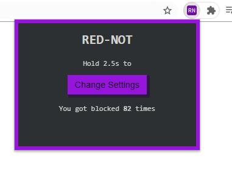
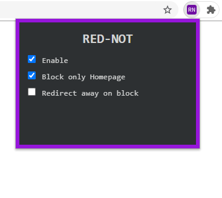

### Rednot

Typescript-based Chrome Extensions to hide reddit homepage feed.

Settings are synced across different computer through Google Chrome sync storage.

### How to use

- clone the repo locally
- run `npm install`
- run `npm run build`
- upload the `dist` folder as an extension on chrome
